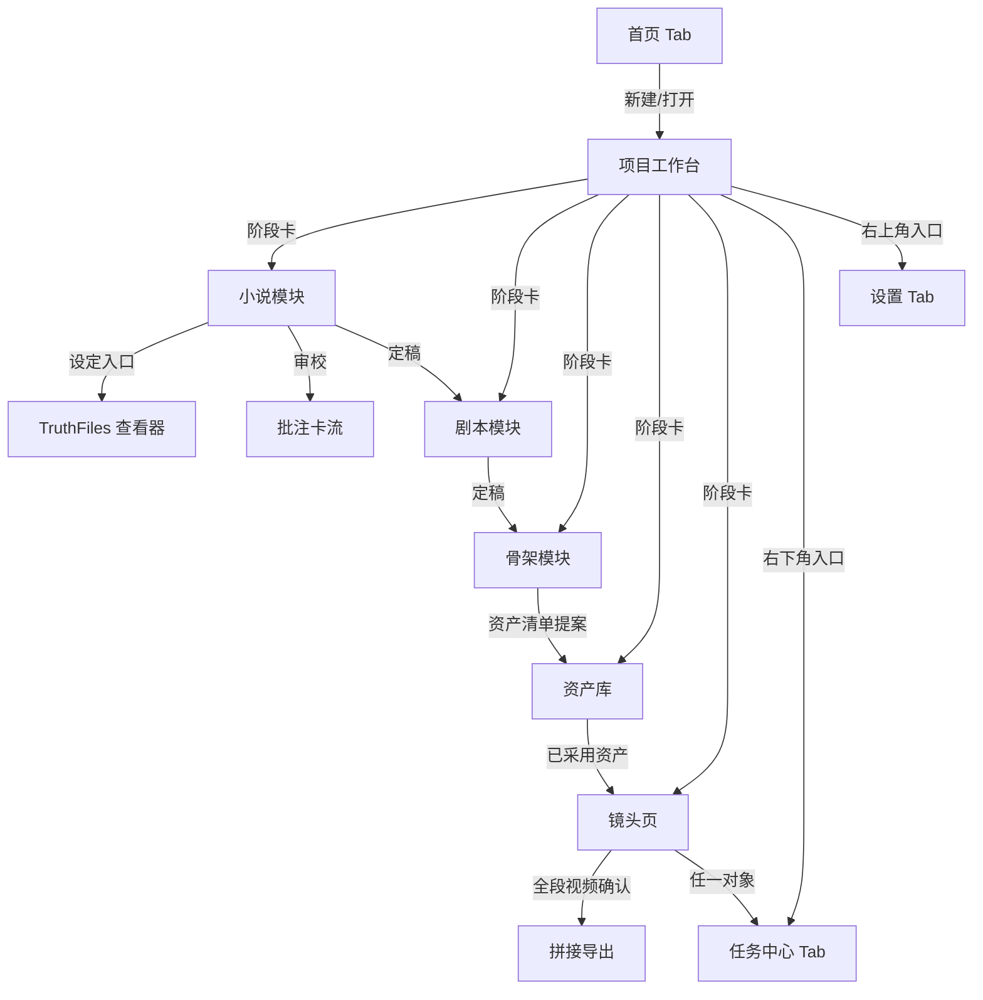

# 05 · UI 设计与手机适配方案

> 基于 Toonflow 桌面截图（projectHome / assetCanvas / directorStudio / videoGeneration）与 web 端源码（`apps/web/src/components/agent/`、`pages/workspace/`）的观察，将「画布 + 节点 + Agent 面板」的桌面范式映射为手机端「流程化 + 列表 + 抽屉对话」范式。功能范围对齐 docs/02（数据模型与状态）、docs/03（五阶段流程）、docs/04（M0–M7 任务）。

---

## 1. Toonflow 桌面 UI 结构观察

| 界面 | 构成 |
|---|---|
| 项目主页 | 顶部设置/GitHub；中央「灵感创作模式」大输入框（底部挂项目选择 + 模型选择 + 发送）；下方项目列表（卡片、网格/列表切换、导入/添加） |
| 工作区画布 | 无限画布为主体；节点卡片（剧本文本、角色四视图、场景、道具、3D 导演台、视频）；连线表达引用；右侧 Agent 对话面板；左下工具栏（缩放/资产库/节点菜单） |
| 视频生成 | 镜头视频节点卡（内嵌播放器 0:12）；提示词卡：编号参考图缩略图（可删）、长提示词、底部配置栏（模型 Seedance-2.5、9:16、480p、12 秒、生成按钮） |
| 3D 导演台 | 模态大窗：3D 视口（WASD）、关键帧轨道、右侧方案列表、提示词输入、导出视频节点 |
| Agent 面板 | 常驻右侧，与画布数据互通（conversation.vue 可证）：快捷开始 chips（搭建画布/梳理分镜/生成素材，带描述与预填 prompt）、模型与思考档位选择、`@` 引用节点/资产（mentionMenu + mentionThumbnail）、工具消息卡（toolMessage）、Agent 中途提问并挂起等待回答（pendingQuestions）、上下文用量提示 |

**桌面范式的三个支柱：无限画布（空间自由）、节点连线（引用可视化）、常驻 Agent 面板（对话驱动）。** 手机屏幕放不下前两个，必须重构信息架构；第三个保留为抽屉。

---

## 2. 适配总策略

| 桌面范式 | 手机端替代 | 理由 |
|---|---|---|
| 无限画布自由编排 | **五阶段流程页（Pipeline 工作台）** | 手机单手操作，线性流程天然适合纵向页面栈 |
| 节点卡片 + 连线 | **详情页内「引用区块」**（镜头详情列出绑定的角色/场景/道具缩略徽章） | 连线的语义 = 引用关系，用徽章 + 缩略图表达更省空间 |
| 右侧常驻 Agent 面板 | **悬浮 AI 球 + 底部抽屉对话**（半屏 60%，可上拉全屏） | 保留对话驱动的核心体验 |
| 节点编辑弹窗 | **底部 Sheet / 全屏编辑页** | 移动端标准交互 |
| 3D 导演台 | **关键帧横向轨道 + 方案列表**（砍 3D 视口，用分镜图当预览） | 3D 视口在手机性能/操作均不佳 |
| 画布工具栏 | 取消 | 无画布则无需缩放工具 |
| 插件市场 | 设置页内「技能管理」（内置 skills 开关/查看） | MVP 不做市场 |
| 模型选择器（散落各处） | **生成参数 Sheet 统一收口** | 一处配置，处处引用 |
| `@` 引用节点/资产 | **上下文徽章 + 引用选择器**（章节/场次/镜头/资产可被 @ 进对话） | 保留「对话绑定具体对象」的能力 |

---

## 3. 信息架构与导航

### 3.1 全局结构（三 Tab，轻导航）

```text
┌─ 首页(项目列表) ─┬─ 任务中心 ─┬─ 设置 ─┐
│                  │            │        │
└── 底部 TabBar ───┴────────────┴────────┘
```

- **首页**：对应 projectHome。顶部「一句话开始创作」输入框 + 项目卡片网格。
- **任务中心**：所有图片/视频生成任务的队列，对应 Toonflow 分散在画布上的生成状态，收拢为一处。
- **设置**：模型供应商（LLM/图/视频三组）、技能管理、数据备份、关于。

### 3.2 项目内结构（流程即导航）

进入项目后隐藏 TabBar，改为：

```text
顶部：← 项目名        [悬浮AI球]
步骤条：●写作 ─ ●剧本 ─ ○骨架 ─ ○资产 ─ ○镜头
下方：五张阶段卡片（纵向列表），每张显示状态/进度/数量
```

### 3.3 页面跳转地图



- 任何页面可通过悬浮 AI 球呼出 Agent 抽屉；Agent 消息内的对象徽章点击后跳转对应页面。
- 跨阶段跳转遵循依赖方向（写作 → 剧本 → 骨架 → 资产 → 镜头）；上游未定稿时下游阶段卡置灰并提示前置条件。

---

## 4. 页面清单与线框

### 4.1 首页 / 项目列表（M0）

```text
┌──────────────────────────┐
│ 小说动漫工坊         [设置]│
│ ┌──────────────────────┐ │
│ │ 一句话开始你的故事…   │ │
│ │ [模型▾]      [开始↗] │ │
│ └──────────────────────┘ │
│ 我的项目          [+新建]│
│ ┌────────┐ ┌────────┐   │
│ │ 封面图  │ │ 封面图  │   │
│ │ 项目名  │ │ 项目名  │   │
│ │ 3章·12镜│ │ 草稿    │   │
│ └────────┘ └────────┘   │
├──────────────────────────┤
│  [项目]   [任务]   [设置] │
└──────────────────────────┘
```

- 「一句话开始」进入 Agent 抽屉并自动带上快捷开始 chips（对齐 Toonflow conversation.vue 的快捷引导）。
- 项目卡：封面（已采用分镜图或首张资产图）、名称、进度摘要（章节数/镜头数/状态）。长按弹出操作（重命名/导出/删除需二次确认）。

### 4.2 项目工作台（Pipeline 首页）

```text
┌──────────────────────────┐
│ ← 演示项目         [AI球]│
│ ●──●──○──○──○ 五阶段步骤条│
│ ┌──────────────────────┐ │
│ │ [写] AI 写小说        ›│ │ 第3章/共10章 · 审校中
│ ├──────────────────────┤ │
│ │ [剧] 动漫剧本         ›│ │ 未开始
│ ├──────────────────────┤ │
│ │ [骨] 剧本骨架         ›│ │ 未开始
│ ├──────────────────────┤ │
│ │ [资] 资产       12 项 ›│ │ 8 已采用
│ ├──────────────────────┤ │
│ │ [镜] 镜头       0/36  ›│ │ 视频待生成
│ └──────────────────────┘ │
```

- 阶段卡右侧状态文案对齐第 6 节状态机；有任务在跑时卡片角落显示进行中指示。
- 上游未定稿时下游卡片置灰，点击提示前置条件（如「先定稿剧本」）。

### 4.3 小说模块（M1）

**章节列表**

```text
┌──────────────────────────┐
│ ← 小说 [设定] [+AI设定/大纲]│
│ ┌──────────────────────┐ │
│ │第1章 定稿   3200字    ›│ │
│ │第2章 定稿   2800字    ›│ │
│ │第3章 审校中 3050字    ›│ │
│ │第4章 草稿   —         ›│ │
│ └──────────────────────┘ │
│         [+AI写下一章]    │
└──────────────────────────┘
```

**编辑器（全屏）**

```text
┌──────────────────────────┐
│ ← 第3章·标题      [更多▾]│
│ 正文 Markdown…           │
│ [流式插入光标▌]          │
├──────────────────────────┤
│[续写][润色][重写][审校]   │
│[设定]            [版本⏱] │
└──────────────────────────┘
```

- 底部快捷条四个动作对应修订模式 `spot-fix`（选中文本定点修）/`polish`/`rewrite` 与审校；无选中文本时 `spot-fix` 置灰。
- AI 输出流式追加；「更多」含章节信息（字数/状态/目标字数）与删除（二次确认）。

**审校批注卡流（Reviewer 输出）**

```text
┌──────────────────────────┐
│ 审校结果 3 条   [全部采纳▾]│
│ ┌──────────────────────┐ │
│ │[冲突] 第3章·第12行    │ │
│ │问题：主角使用已丢失的刀│ │
│ │依据：第1章末刀已遗失   │ │
│ │影响：与道具状态矛盾    │ │
│ │修复：改为徒手/寻回铺垫 │ │
│ │范围:[局部]   [采纳][忽略]│ │
│ └──────────────────────┘ │
└──────────────────────────┘
```

- 每条含：类型标签（冲突/OOC/时间线/伏笔/道具/文风）、问题、依据（引用章节或 TruthFile）、影响、最小修改方向、影响范围（局部/结构）。
- 「采纳」触发定点修订（Writer spot-fix）并生成新版本；批注保留原稿对照。

**设定工坊（TruthFiles 查看器，7 类 Tab）**

```text
┌──────────────────────────┐
│ ← 设定   [AI 补全提案]    │
│ [世界|角色|资源|伏笔|摘要] │
│ [意图|焦点]               │
│ ┌──────────────────────┐ │
│ │世界事实（三元组）      │ │
│ │·主角—持有—木剑 [1-3章] │ │
│ │·主角—所在—北城 [4章-]  │ │
│ ├──────────────────────┤ │
│ │伏笔钩子               │ │
│ │·黑玉令 开启·第2章 预期…│ │
│ └──────────────────────┘ │
└──────────────────────────┘
```

- 世界事实按 SPO 三元组展示并标注生效章节区间（对齐 InkOS current_state 机制）；伏笔钩子展示五状态（开启/推进中/搁置/已回收/已取代）与预期回收。
- 「AI 补全提案」产生的改动一律以提案卡呈现，用户确认后才写入（事实/提案/未知三分法）。
- 章节定稿时自动更新（Settler 增量 delta），更新记录可在「版本」中回看。

### 4.4 剧本模块（M2）

```text
┌──────────────────────────┐
│ ← 剧本 [改编范围▾] [定稿] │
│ ┌──────────────────────┐ │
│ │ 场01 · 老宅客厅·夜    │ │
│ │ [林直人][佐藤] 人物徽章│ │
│ │ 摘要两行…             │ │
│ ├──────────────────────┤ │
│ │ 场02 · …             │ │
│ └──────────────────────┘ │
│        [AI 改编本段 +]   │
└──────────────────────────┘
```

- 顶部「改编范围」选择章节/选段（对齐「先锁定本次范围」规则），锁定后下游以该版本为输入。
- 场次详情：动作 / 对白（说话人分色）/ OS·VO / 声音 / 结束状态 / 转场，分区编辑。
- 改编提案以「待确认卡」插入流中（含依据），逐条[采用][拒绝]后才写入剧本；正文对白默认保留原文。
- 版本管理：草案/定稿两态，历史版本可查看与恢复（见第 7 节）。

### 4.5 骨架模块（M3）

```text
┌──────────────────────────┐
│ ← 骨架 [列表|时间轴] [导出]│
│ [Batch1(6段)] [Batch2(6段)]│
│ ┌──────────────────────┐ │
│ │ G01 · 00:00-00:12·12s│ │
│ │ 节拍:[E01动作][E02对白]│ │
│ │ 出镜: 直人(说) 佐藤(听)│ │
│ │ ⚠ E17 未映射到任何段   │ │
│ ├──────────────────────┤ │
│ │ G02 · …              │ │
│ └──────────────────────┘ │
│      [重新提取]          │
└──────────────────────────┘
```

- 段卡展开：节拍明细（编号/类型/内容/估时）、角色出镜时间轴、场景锚点与机位、道具状态链（段首位置/动作/段末状态/禁止项）。
- 「源剧情账本」完整性检查：任何 E## 未映射到段、段内出现无 E## 依据的状态变化时标红并定位（对齐 A2 规则）。
- 时间轴视图：横向按全局时间排段卡，标注 Batch 分界。
- 重新提取需确认：展示将覆盖的段数与已绑定的参考关系影响面。

### 4.6 资产模块（M4）

**进入先出「资产清单提案」**（AssetDesigner 从骨架提取）：

```text
┌──────────────────────────┐
│ 资产清单提案 12 项 [全部采用]│
│ ┌──────────────────────┐ │
│ │[复用] 佐藤·角色        │ │
│ │[新建] 老宅客厅·场景     │ │
│ │[变体] 直人·伤装(基于基础)│ │
│ │[合并?] 黑衣人A/B 疑同人  │ │
│ └──────────────────────┘ │
└──────────────────────────┘
```

**资产库与详情**

```text
┌──────────────────────────┐
│ ← 资产 [角色|场景|道具]   │
│ ┌────┐ ┌────┐ ┌────┐    │
│ │四视图│ │四视图│ │     │    │
│ │直人✅│ │佐藤✅│ │+新增 │    │
│ └────┘ └────┘ └────┘    │
└──────────────────────────┘
资产详情（全屏）：
[四视图大图轮播]
外观锚点字段表 · 变体列表(横向小卡)
[重新生成]  [采用/废弃]  [生成变体]
```

- 清单提案逐条确认后才进入生成队列；「合并/拆分」建议（如同名别名）由用户裁决。
- 对白提及但不出镜的角色不出现在清单（对齐「只生成真实出现且需复用」规则）。
- 设计提案（外观锚点缺失时 AI 补全）标注「提案」徽章，与原文事实区分。
- 状态机贯穿：待生成 → 生成中 → 待验收（大图预览 + [采用][废弃][重新生成]）→ 已采用；变体基于已采用基础图做图生图。

### 4.7 镜头模块（M5 分镜图 + M6 视频，核心页）

**镜头列表**

```text
┌──────────────────────────┐
│ ← 镜头 [Batch1|Batch2]    │
│ ┌──────────────────────┐ │
│ │[分镜图16:9]           │ │
│ │G03 中景·侧面·12s      │ │
│ │直人 佐藤 客厅 参考徽章  │ │
│ │状态: 分镜图已确认       │ │
│ └──────────────────────┘ │
│ [全选][生成选中分镜图]     │
└──────────────────────────┘
```

**镜头详情（全屏）**

```text
┌──────────────────────────┐
│ ← G03 · 12s · 00:24-00:36│
│ ┌──────────────────────┐ │
│ │ 分镜图/视频预览 ▶     │ │
│ └──────────────────────┘ │
│ [提示词] [视频模板] 切换   │
│ 提示词：                  │
│ 主体/景别/角度/构图/表演…  │
│ 参考绑定:                 │
│ [1]直人四视图 [2]客厅主视图│
│ ── 视频模板（A9.2 字段）── │
│ Objective: …             │
│ Immutable locks: …       │
│ Timeline:                  │
│ 【0:00-0:06】              │
│ 画面为中景，主体是阿青；…  │
│ Preserve / Avoid: …      │
│ ⚠ 段间衔接提示：与G02主体相同│
│ ┌──────────────────────┐ │
│ │[模型▾ 画幅▾ 分辨率▾ 时长]│ │
│ │[生成分镜图]  [生成视频] │ │
│ └──────────────────────┘ │
└──────────────────────────┘
```

- 列表卡：分镜图缩略、段号/时长、景别/角度 chips、绑定资产头像（替代连线）、状态徽章。
- 详情双 Tab：「提示词」（分镜图用，含 `{{ref N}}` 编号绑定，参考图缩略可增删排序）与「视频模板」（A9.2 字段化编辑：Objective / Reference binding / Immutable locks / Target duration / Timeline（时间块 + 连续自然语言，帧间 HARD CUT 标注）/ Visual direction / Audio direction / Preserve / Avoid；字段内容默认由 Director Agent 预填，用户可改）。
- 段间衔接校验结果以提示条展示（主体相同/景别差不足/角度差不足时警告，对齐 A7）；跨段连续性问题（道具状态断裂、人物位置跳变）在列表页顶部汇总。
- 生成按钮进入统一确认 Sheet（第 5.1 节）；批量生成展示对象数与预计段数。
- 视频预览用内嵌播放器；未生成时展示分镜图占位。

### 4.8 Agent 抽屉对话（对应右侧面板）

```text
任意页面 [AI球] 悬浮球
   ↓ 点击
┌──────────────────────────┐
│ ‾‾‾ 半屏抽屉(60%)可上拉 ‾‾‾│
│ 快捷开始（空会话时）：      │
│ [梳理故事分镜][生成图片素材]│
│ [继续写下一章][提取骨架]    │
│ AI: 已完成 G01-G03 提示词  │
│ [工具卡: 写入3个镜头提示词 ✓]│
│    ┌ 待你决定 ─────────┐  │
│    │·是否生成2段小样?    │  │
│    │[确认执行][先看方案]  │  │
│    └──────────────────┘  │
│ AI: 想先确认一件事？       │
│    ·镜头1-16暴力如何处理?   │
│    [替换为侧写][保留]      │
│ [上下文: @镜头G03 @直人]   │
│ [输入…][@][模型▾思考档▾]   │
│ 上下文用量 ▓▓▓░░ 62%      │
└──────────────────────────┘
```

- 消息类型（对齐 Toonflow conversation.vue 可证交互）：文本流、**工具卡**（Agent 调用了什么、写了哪些数据，可点开看 diff）、**待决定卡**（生成授权，接第 5.1 节）、**提问卡**（Agent 中途挂起等待，用户答后继续）、快捷开始 chips（空会话）。
- `@` 引用选择器：可引用章节/场次/镜头/资产，被引用对象以缩略徽章挂在输入框上方，点击跳转对应页面。
- 模型选择 + 思考档位（复用全局供应商配置）；上下文用量条提示剩余空间。
- Agent 产出的所有数据变更走「提案 → 确认 → 落库」，与页面内操作同一套确认组件。

### 4.9 任务中心（Tab 2）

```text
┌──────────────────────────┐
│ 任务中心        [全部|本项目]│
│ ┌──────────────────────┐ │
│ │[图] G03分镜图 生成中▓▓░ │ │
│ │    演示项目 · 2分钟前    │ │
│ ├──────────────────────┤ │
│ │[图] 直人四视图 成功 ✅   │ │
│ │    [查看][采用][废弃]    │ │
│ ├──────────────────────┤ │
│ │[视] G02视频 失败        │ │
│ │    错误: 供应商超时       │ │
│ │    [重试][查看参数]      │ │
│ └──────────────────────┘ │
└──────────────────────────┘
```

- 任务详情 Sheet：完整提示词、参数快照、供应商、耗时、费用（可查时）、错误详情、产物文件。
- 按项目分组，支持下拉刷新；前台轮询，退后台暂停（对齐 doc 02 第 6 节）。
- 失败任务重试复用原参数快照；「已采用/已废弃」由用户在详情中标记。

### 4.10 供应商配置（设置 Tab，M0）

```text
┌──────────────────────────┐
│ 设置                      │
│ 模型供应商                 │
│ [LLM]  DeepSeek   [测试✓] ›│
│ [图片] GPT-Image  [未测试] ›│
│ [视频] Seedance   [未配置] ›│
│ 技能管理 (14 个内置技能)   ›│
│ 数据备份 (导出/导入)       ›│
│ 关于                      ›│
└──────────────────────────┘
供应商编辑（Sheet）：
名称/BaseUrl/APIKey(密文)/协议▾
模型列表(+添加)   [连接测试]
```

- 三组分开管理；「连接测试」发一次最小请求验证 BaseUrl/Key/模型可用（LLM 流式一句、图片/视频探测任务端点）。
- API Key 输入密文显示，存 secure storage，不入 DB 明文（对齐 AGENTS.md 安全红线）。
- 技能管理：列出内置 skills（对应 docs/03 第 6 节目录），可查看内容与启停开关。

### 4.11 拼接导出（M6/M7）

```text
┌──────────────────────────┐
│ ← 拼接导出                │
│ ┌──────────────────────┐ │
│ │[G01][G02][G03]… 横向轨│ │
│ └──────────────────────┘ │
│ 已选 36/36 段 · 总时长 7:12│
│ 缺失段: G17(视频未生成) ⚠  │
│ [导出拼接视频]  [导出项目包]│
└──────────────────────────┘
```

- 时间轨按段序排列视频片段，缺段标红；导出走本地拼接（MVP 可先导出 zip + 段清单，FFmpeg 拼接按需启用）。
- 「导出项目包」= zip（JSON 元数据 + 图片/视频/正文），对齐 doc 02 第 7 节备份机制。

---

## 5. 全局组件规范

### 5.1 生成确认 Sheet（算力授权三步，对齐 canvasExecution.md）

```text
┌──────────────────────────┐
│ 确认生成                  │
│ 对象: G03、G04（2 个镜头）  │
│ 类型: 分镜图（图生图+参考）  │
│ 参考文件: 直人四视图、客厅   │
│ 参数: 模型▾ 9:16 1024p     │
│ 执行次数: 2 次             │
│ 费用: 约 ¥0.4（不可查时显示"未知"）│
│ [取消]         [确认执行]  │
└──────────────────────────┘
```

1. **固定方案**：展示对象、数量、完整提示词（可展开）、参数、参考文件与顺序、执行次数；费用不可查时明确「未知」，不把对话 token 当媒体消耗。
2. **授权执行**：点击确认后进入任务队列，任务中心可见。
3. **临执行复核**：任务真正提交前重读当前数据，若对象/参数/参考已变化，差异项高亮并重新请求授权；沿用仍匹配的部分。

### 5.2 AI 提案卡（事实/提案/未知三分法）

- 统一样式：左侧类型色条 + 徽章。`[事实]` 引用原文/TruthFile 出处；`[提案]` 灯泡标记并附依据与影响；`[未知]` 问号标记，明确「原文未提供」。
- 所有 AI 产出的新增数据（设定补全、改编补充、外观锚点、镜头提示词）默认走提案卡，[采用]后才落库并标为已确认。

### 5.3 状态徽章体系

| 实体 | 状态 → 徽章样式 |
|---|---|
| 章节 | 草稿(灰) / 审校中(蓝) / 定稿(绿) |
| 剧本 | 草案(灰) / 定稿(绿) |
| 节拍 | 已映射(绿) / 未映射(红) |
| 资产 | 待生成(灰) / 生成中(蓝) / 待验收(橙) / 已采用(绿) / 废弃(删除线) |
| 镜头 | 待提示词(灰) / 待分镜图(蓝) / 分镜图已确认(青) / 视频生成中(蓝) / 视频完成(绿) |
| 任务 | 排队/提交/生成中(蓝) / 成功(绿) / 失败(红) / 已采用(绿) / 已废弃(灰) |

### 5.4 空态 / 加载态 / 错误态

- 空态：插画 + 一句引导 + 主操作按钮（如「还没有章节，[AI 生成大纲] 或 [手动新建]」）。
- 加载态：LLM 流式显示插入光标 + 已生成字数；媒体任务显示进度条与阶段（排队/生成中）。
- 错误态：区分网络错误 / 供应商错误 / 解析错误；提供[重试]（复用参数快照）与[查看详情]；解析失败时展示原始返回片段辅助排障（脱敏，不含 Key）。

---

## 6. 实体状态与 UI 映射（对齐 docs/02 数据模型）

| 阶段流转 | UI 呈现 |
|---|---|
| Pipeline 阶段：待执行 → 执行中 → 待人工确认 → 已确认/已修订 | 工作台步骤条圆点 + 阶段卡右侧文案；「待人工确认」时卡片高亮并推送入口 |
| 每阶段可回溯重跑 | 阶段卡「重新生成」入口 + 影响面确认（第 7 节） |
| 上游定稿 → 下游解锁 | 阶段卡置灰/解锁；步骤条连线随完成度点亮 |

---

## 7. 影响面与版本（修改传播）

- **影响面横幅**：在章节/剧本/骨架/资产详情修改并保存时，若下游已生成数据依赖该对象，顶部展示横幅：「本次修改影响：剧本场01、骨架G02-G05、资产直人，[查看] [仍要保存]」，避免静默失效（对齐 Toonflow「局部修订沿实际使用关系检查受影响资产/片段/声音/交界状态」）。
- **版本历史抽屉**：章节/剧本/资产/镜头提示词均记录 revision；抽屉按时间列出版本（谁改的：用户/AI、变更摘要），支持[预览][恢复]（恢复同样走影响面确认）。
- **断点续跑**：App 重启后任务中心与阶段卡恢复中断状态，可从失败点重试，已完成数据不丢（对齐 doc 02 状态机约束）。

---

## 8. 手机 UI 原则

1. **主操作沉底**：生成、续写、确认等高频按钮放底部工具条/Sheet，单手可达。
2. **阶段即导航**：步骤条 + 流程卡替代画布空间关系；跨阶段跳转走详情页引用徽章。
3. **生成确认统一**：所有消耗算力的操作都走同一「确认 Sheet」组件（对象/数量/参数/费用/临执行复核）。
4. **深色优先**：沿用 Toonflow 深色调性（创作工具、图片预览友好），Material 3 深色 seed，浅色可选。
5. **竖屏优先**：分镜/视频统一 16:9 或 9:16 预览卡；横屏仅视频全屏播放。
6. **离线容忍**：本地数据随时可编辑；生成类操作明示需网络。
7. **手势约定**：列表卡长按多选；卡片侧滑仅暴露次级操作（删除需二次确认）；Agent 抽屉上拉全屏、下拉收起；任务中心下拉刷新。

---

## 9. Flutter 实现映射

| UI 元素 | 组件/库 |
|---|---|
| 底部 Tab + 项目内流程栈 | `go_router` + `StatefulShellRoute` |
| 五阶段步骤条 | 自定义 `StepBar`（线性指示器） |
| 小说编辑器 | `flutter_quill`（Markdown 快捷条 + 自定义批注 Embed） |
| 流式输出插入 | `Riverpod` StreamProvider + 编辑器增量插入 |
| Agent 抽屉 | `DraggableScrollableSheet` + 悬浮 `FloatingActionButton.location` |
| `@` 引用选择器 | 自定义 Overlay + 实体搜索 Provider |
| 资产/项目网格 | `SliverGrid` + 本地文件缩略（`Image.file` + 缓存目录） |
| 确认 Sheet / 参数 Sheet / 任务详情 Sheet | `showModalBottomSheet` 统一封装（固定方案→授权→复核三态） |
| 视频预览 | `video_player`（列表内禁自动播放，进详情手动播） |
| 时间轴视图 | 自定义 `CustomScrollView` + 横向 `ListView`（骨架/拼接导出复用） |
| 消息流（文本/工具卡/提案卡/提问卡） | `SliverList` + 按消息类型分发的 Card 组件族 |
| 状态徽章 | 统一 `StatusBadge`（枚举 → 色板映射，见 5.3） |
| 主题 | `Material 3`，`ColorScheme.fromSeed` 深色默认 |

---

## 10. 与桌面功能的取舍清单

| 保留（适配后） | 砍掉/后置 |
|---|---|
| 灵感创作输入框、项目列表 | 无限画布 |
| 五阶段流程 + 各阶段编辑 | 节点拖拽连线 |
| Agent 对话（抽屉化：快捷开始/工具卡/提问卡/待决定卡/@引用） | 插件市场（后置） |
| 参考图编号绑定（徽章化） | 3D 导演台视口（用关键帧轨道替代） |
| 生成参数配置栏（Sheet 化 + 临执行复核） | 多画布管理（单项目单流程） |
| 任务队列（集中化） | MCP / A2A（不适用移动端） |
| 影响面检查与版本记录（横幅+抽屉） | 画布多选框选/框选批量操作（改列表多选） |

---

## 11. 与开发计划的对照（确保 M0–M7 全部有 UI 承载）

| 里程碑 | 对应页面/组件 |
|---|---|
| M0 工程初始化 | 4.1 首页、4.10 供应商配置、TabBar 框架 |
| M1 AI 写小说 | 4.3 章节列表/编辑器/批注卡/设定工坊（TruthFiles） |
| M2 小说→剧本 | 4.4 改编范围、场次编辑、提案确认卡、版本抽屉 |
| M3 骨架提取 | 4.5 段卡/时间轴/E## 校验/出镜状态编辑 |
| M4 资产图片 | 4.6 清单提案、资产库、详情与验收 |
| M5 分镜图 | 4.7 列表/详情（提示词 Tab）、`{{ref N}}` 绑定、确认 Sheet、任务中心 |
| M6 视频 | 4.7 视频模板 Tab、衔接/连续性提示、视频预览、4.11 拼接导出 |

---

## 12. M16 · 集参数与时长校验的 UI 承载

### 12.1 分集参数卡（剧本详情页）

剧本详情页在版本/忠实度卡片下方新增「分集参数」卡（`_EpisodeParamEditor`），三行：

| 行 | 控件 | 说明 |
|---|---|---|
| 集序号 | 数字输入（可清空） | 空表示不参与分集；同一书内递增 |
| 目标总时长（秒） | 数字输入 | 0 或空表示由内容自然节奏决定，此时不做总量偏差校验 |
| 目标模型版本 | 单选 `2.0` / `2.5`（可清空） | 决定单段时长上限回落值与批次容量 |

保存按钮仅在 dirty 时可用；保存后 snackbar 提示。该卡不参与算力授权，属纯元数据编辑，走剧本已有的自动保存路径。

单段时长上限**不在 UI 暴露数字**：它来自当前视频模型的 `supportedDurations` 最大值（运行时），UI 只在提取结果里体现。

### 12.2 时长预算面板（镜头列表页）

镜头列表页现有「段间衔接提示（A7）」面板，其下并列新增「时长预算」面板：

- 空态不渲染（无 issue 时不占空间）。
- 每条一卡：段号 `G0N` + code 标签 + message + 严重度徽章。
- `error` 用警示色（`StatusKinds.error` 同色板），`warn` 用中性色。
- 面板标题带条数，与 A7 面板样式一致，复用现有列表项结构。

`SegmentBudgetIssue` 的 code 与展示标签映射：

| code | 标签 | 严重度 |
|---|---|---|
| `over_limit` | 超出单段上限 | error |
| `dialogue_overflow` | 台词装不下 | error |
| `total_mismatch` | 与目标总时长偏差大 | warn |
| `too_few_segments` | 段数偏少 | warn |
| `batch_too_large` | 单批段数过多 | warn |

### 12.3 视频提交时的时长冲突提示

`submitVideo` 命中 `error` 级 issue 时，`ConfirmSheet` 的 `note` 追加逐条文案（段号 + 数值差异），用户明确勾选后才提交。对齐「确认简报 ≠ 确认剧本 ≠ 确认资产 ≠ 验收生成结果」的阶段门纪律，时长冲突属于**临执行复核**的一部分。

| M7 打磨发布 | 4.10 备份、5.4 三态完善、影响面横幅与版本抽屉收口 |

---

## 13. 实现状态对照（截至 M19）

### 13.1 已落地页面（20 个路由）

| 路由 | 页面 | 对应章节 |
|---|---|---|
| `/` | `ProjectPage` 项目列表 + 新建 | 4.1（部分） |
| `/tasks` | `TaskPage` 任务中心 | 4.9 |
| `/tasks/attempts` | `AttemptLogPage` 生成台账（只读） | 4.9 延伸 |
| `/settings` | `ProviderConfigPage` 供应商配置 | 4.10 |
| `/settings/prompts/:projectId` | `PromptOverridePage` 提示词覆盖 | 4.10 延伸 |
| `/novel/:projectId` | `NovelShelfPage` 书架 | 4.3 |
| `/novel/:projectId/chapter/:chapterId` | `ChapterEditorPage` 章节编辑 + 审校 + 定稿 | 4.3 |
| `/novel/:projectId/settings` | `SettingWorkshopPage` 设定工坊 | 4.3 |
| `/novel/:projectId/outline` | `OutlineEditorPage` 大纲 | 4.3 |
| `/novel/:projectId/characters` | `CharacterManagerPage` 角色矩阵 | 4.3 |
| `/novel/:projectId/hooks` | `HookManagerPage` 伏笔池 | 4.3 |
| `/script/:projectId` | `ScriptPage` 剧本列表 | 4.4 |
| `/script/:projectId/script/:scriptId` | `ScriptDetailPage` 剧本详情 | 4.4 |
| `/script/:projectId/script/:scriptId/versions` | `ScriptVersionsPage` 剧本版本 | 4.4 |
| `/script/:projectId/script/:scriptId/scene/:sceneId` | `SceneEditPage` 场次编辑 | 4.4 |
| `/script/:projectId/script/:scriptId/skeleton` | `SkeletonPage` 骨架 + 账本校验 | 4.5 |
| `/script/:projectId/script/:scriptId/assets` | `AssetGalleryPage` 资产画廊 | 4.6 |
| `/script/:projectId/script/:scriptId/asset/:assetId` | `AssetDetailPage` 资产详情 | 4.6 |
| `/script/:projectId/script/:scriptId/shots` | `ShotListPage` 分镜列表 + 预算面板 | 4.7、12.2 |
| `/script/:projectId/script/:scriptId/shot/:shotId` | `ShotDetailPage` 镜头详情（分镜图 / 视频 / 服装覆盖） | 4.7、4.11 |

导航是**脚本层级**（项目 → 剧本 → 骨架 → 资产 → 镜头），通过面包屑与上一页返回走，没有 §4.2 描述的独立「项目工作台」首页。

### 13.2 未落地项与处置

| 项 | 来源章节 | 处置 |
|---|---|---|
| 五阶段步骤条（`StepBar`） | 2、3.2、4.2、510 | **不实现**。流程进度已由「阶段入口可见性 + 影响面横幅」承载；步骤条在手机上占屏且不产生额外信息。 |
| Pipeline 工作台首页 | 2、4.2 | **不实现**。项目页直接进剧本，剧本详情即阶段入口聚合页。 |
| Agent 抽屉（`DraggableScrollableSheet`） | 3.3、4.8、518 | **不实现**。各阶段 AI 能力以就地操作形式挂到对应页面（写作 / 改编 / 提取 / 出图 / 出视频），统一走 `ConfirmSheet`。无自由对话面板。 |
| 「一句话开始创作」输入框 | 4.1、4.3 | **不实现**。项目创建走标题 + 类型表单，创作入口在书架页新建作品。 |

### 13.3 已落地但本文档未描述的页面

| 页面 | 说明 |
|---|---|
| `AttemptLogPage` 生成台账 | M14 产物可回溯：只读展示历次生成尝试的提示词 / 参数 / 引用 / 授权指纹。 |
| `PromptOverridePage` 提示词覆盖 | M19 T21.11：三级覆盖编辑器，按 12 个插槽分组。 |
| `HookManagerPage` 伏笔池 | P3-14：伏笔新增 / 编辑 / 回收 / 删除。 |
| `CharacterManagerPage` 角色矩阵 | P0-2：角色新增 / 编辑，外观锚点结构化。 |
| `OutlineEditorPage` 大纲编辑 | P0-1：逐章目标 / 事件 / 结尾独立编辑。 |
| `SceneEditPage` 场次编辑 | M2 场次级编辑，与剧本版本快照联动。 |
| `ScriptVersionsPage` 剧本版本 | T2.5 剧本版本回溯。 |
